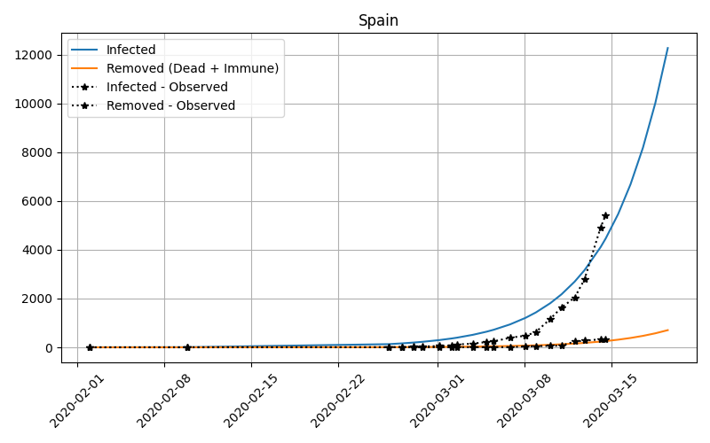
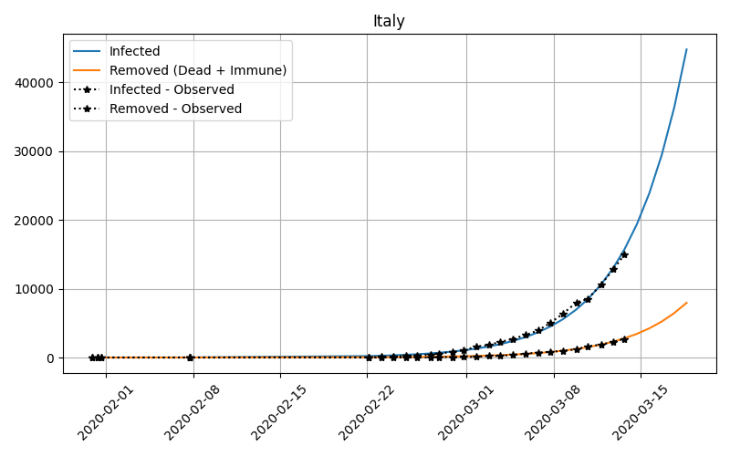
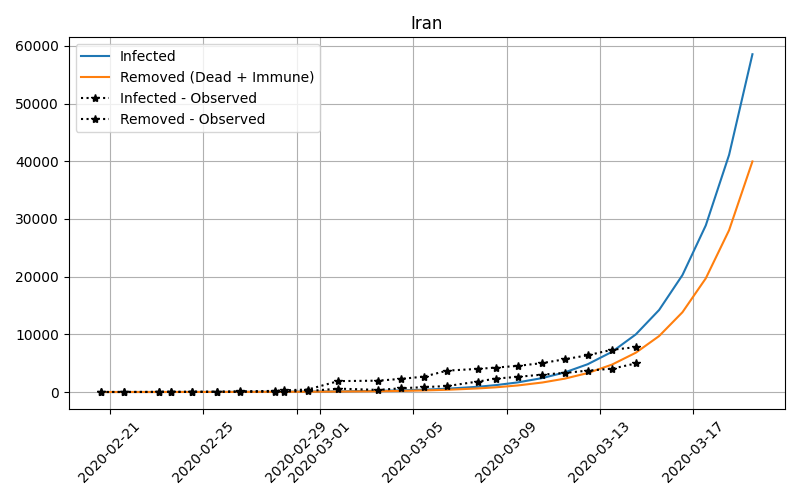
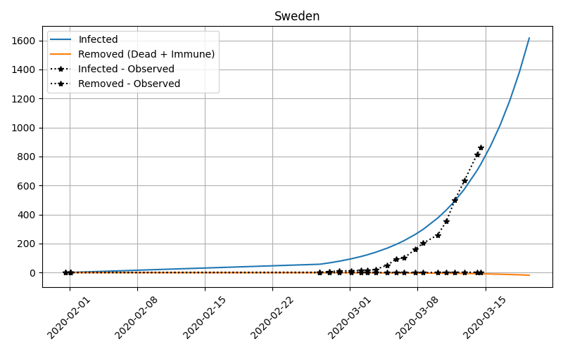
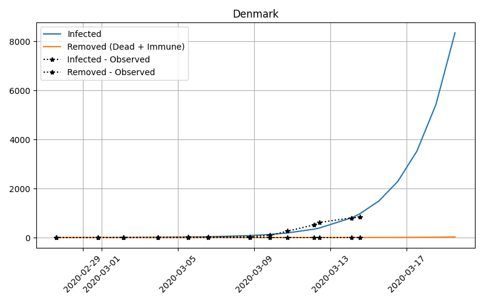

# Forecasting COVID-19 cases

Attempt to forecast the number of cases of COVID-19 around the world using the simple SIR model.

## Forecasts updated: 14-03-2020

Forecast are based on the simple [SIR model](https://en.wikipedia.org/wiki/Compartmental_models_in_epidemiology#The_SIR_model) which assumes
an individual can be one of three states:

- Susceptible: Part of the population not immune to the disease 
- Infected: Are currently infected.
- Removed: Are immune after a recovery or dead.

The model is governed by two parameters, the rate at which individuals contract the disease 𝛽 (beta), and the rate at which they are removed from the infected group 𝛾 (gamma). 

