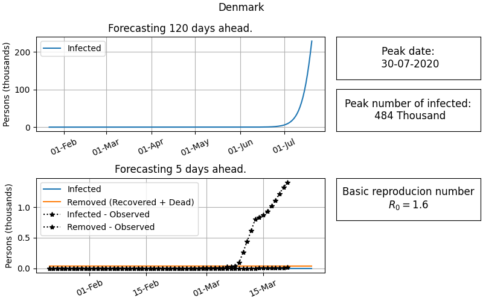
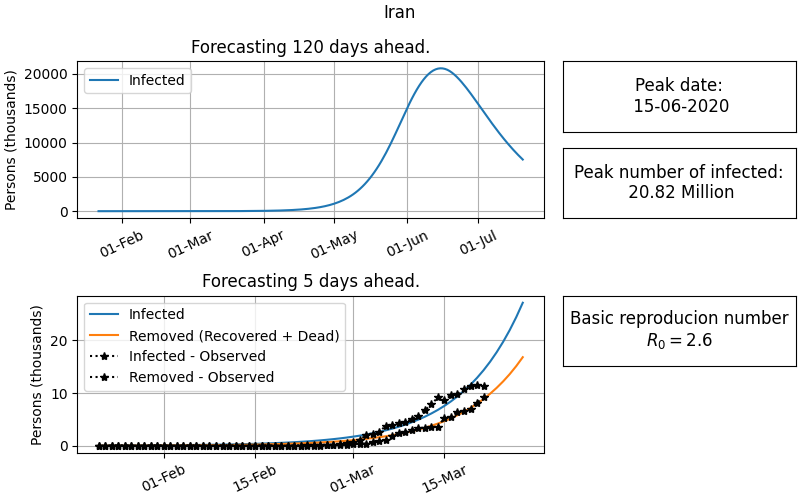
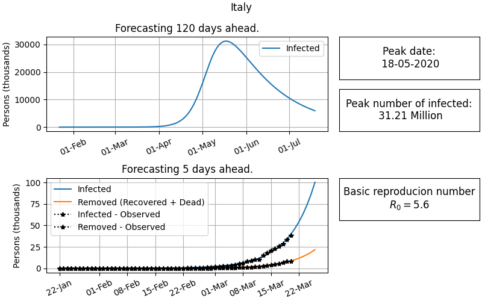
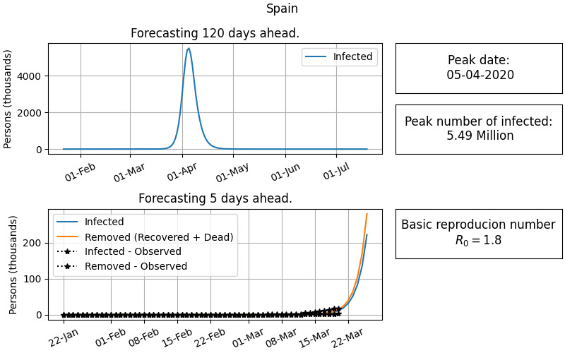
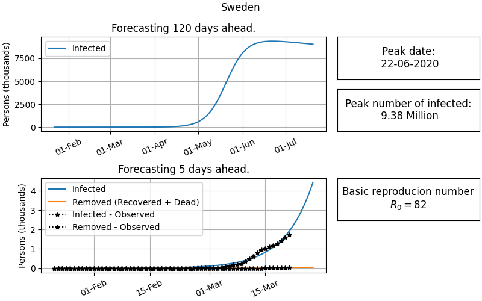

<h1 align="center">Forecasting COVID-19 cases</h1>

Attempt to forecast the number of cases of COVID-19 around the world using the simple [SIR model][sir_model_wiki].

The development of the estimation method is documented in the [CHANGELOG of the analysis section](analysis/CHANGELOG.md). 

## Forecasts
*Updated: 28-03-2020*

Forecasts are based on the simple [SIR model][sir_model_wiki] which assumes
an individual can be in one of three states,

- Susceptible: Part of the population not immune to the disease, 
- Infected: Is currently infected,
- Removed: Is immune after a recovery or death.

The model is governed by two parameters, the rate at which individuals contract the disease 𝛽 (beta), and the rate at which they are removed from the infected group 𝛾 (gamma). 

Data is downloaded from *Johns Hopkins University Center for Systems Science and Engineering* COVID-19 [data repository][csse-data-repo], used in their 
[dashboard][john-hopkins-dashboard] app.

### Plots
||
|:----------------------------------------:|
| *Latest data point: 27-03-2020*|

||
|:----------------------------------------:|
| *Latest data point: 23-03-2020*|

||
|:----------------------------------------:|
| *Latest data point: 27-03-2020*|

||
|:----------------------------------------:|
| *Latest data point: 27-03-2020*|

||
|:----------------------------------------:|
| *Latest data point: 27-03-2020*|

[sir_model_wiki]: https://en.wikipedia.org/wiki/Compartmental_models_in_epidemiology#The_SIR_model
[csse-data-repo]: https://github.com/CSSEGISandData/COVID-19
[john-hopkins-dashboard]: https://www.arcgis.com/apps/opsdashboard/index.html#/bda7594740fd40299423467b48e9ecf6
