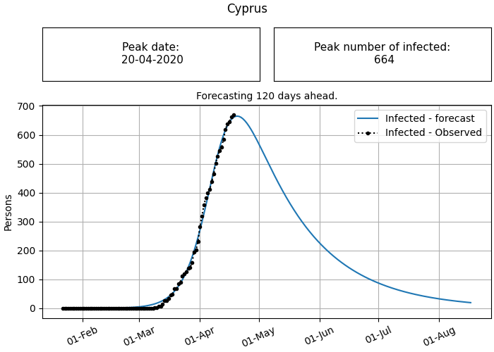

<h1 align="center">Forecasting COVID-19 cases</h1>

Attempt to forecast the number of cases of COVID-19 around the world using the simple [SIR model][sir_model_wiki].

The development of the estimation method is documented in the [CHANGELOG of the analysis section](analysis/CHANGELOG.md).

The site is hosted here: https://duffau.github.io/covid-19-forecast/.

## Forecasts
*Updated: 19-04-2020*

Forecasts are based on a variation of the simple [SIR model][sir_model_wiki] found 
in the article of [Bohner et al (2018)].

In the model an individual can be in one of three states,

- Susceptible: Part of the population not immune to the disease, 
- Infected: Is currently infected,
- Removed: Is immune after a recovery or death.

The model is governed by two parameters, the rate at which individuals contract the disease, 
and the rate at which they are removed from the infected group. 

The current model is only fitted on the number of infected using the closed form solution
from [Bohner et al (2018)]. The fitted equation is given by,

```python
I_t = I_0 * (1 + kappa)**(b/(b-c))*(1 + kappa*exp((b-c)(t-t_0)))**(-b/(b-c)) * exp((b-c)*(t-t_0)).
```

where `b` and `c` are free parameters governing the rate of transmission and recovery, respectively, 
`I_0` is the number of infected at time `t_0` and `kappa = I_0/S_0`.

Data is downloaded from *Johns Hopkins University Center for Systems Science and Engineering* 
COVID-19 [data repository][csse-data-repo], used in their [dashboard][john-hopkins-dashboard] app.

### Plots

||
|:----------------------------------------:|
| *Latest data point: 18-04-2020*|

||
|:----------------------------------------:|
| *Latest data point: 18-04-2020*|

||
|:----------------------------------------:|
| *Latest data point: 18-04-2020*|

||
|:----------------------------------------:|
| *Latest data point: 18-04-2020*|

||
|:----------------------------------------:|
| *Latest data point: 18-04-2020*|

||
|:----------------------------------------:|
| *Latest data point: 18-04-2020*|

||
|:----------------------------------------:|
| *Latest data point: 18-04-2020*|

||
|:----------------------------------------:|
| *Latest data point: 18-04-2020*|

||
|:----------------------------------------:|
| *Latest data point: 18-04-2020*|

||
|:----------------------------------------:|
| *Latest data point: 18-04-2020*|

||
|:----------------------------------------:|
| *Latest data point: 18-04-2020*|

||
|:----------------------------------------:|
| *Latest data point: 18-04-2020*|

||
|:----------------------------------------:|
| *Latest data point: 18-04-2020*|

||
|:----------------------------------------:|
| *Latest data point: 18-04-2020*|

||
|:----------------------------------------:|
| *Latest data point: 18-04-2020*|

||
|:----------------------------------------:|
| *Latest data point: 18-04-2020*|

||
|:----------------------------------------:|
| *Latest data point: 18-04-2020*|

||
|:----------------------------------------:|
| *Latest data point: 18-04-2020*|

||
|:----------------------------------------:|
| *Latest data point: 18-04-2020*|

||
|:----------------------------------------:|
| *Latest data point: 18-04-2020*|

||
|:----------------------------------------:|
| *Latest data point: 18-04-2020*|

||
|:----------------------------------------:|
| *Latest data point: 18-04-2020*|

||
|:----------------------------------------:|
| *Latest data point: 18-04-2020*|

||
|:----------------------------------------:|
| *Latest data point: 18-04-2020*|

||
|:----------------------------------------:|
| *Latest data point: 18-04-2020*|

||
|:----------------------------------------:|
| *Latest data point: 18-04-2020*|

||
|:----------------------------------------:|
| *Latest data point: 18-04-2020*|

||
|:----------------------------------------:|
| *Latest data point: 18-04-2020*|

||
|:----------------------------------------:|
| *Latest data point: 18-04-2020*|

||
|:----------------------------------------:|
| *Latest data point: 18-04-2020*|

||
|:----------------------------------------:|
| *Latest data point: 18-04-2020*|

||
|:----------------------------------------:|
| *Latest data point: 18-04-2020*|

||
|:----------------------------------------:|
| *Latest data point: 18-04-2020*|

||
|:----------------------------------------:|
| *Latest data point: 18-04-2020*|

||
|:----------------------------------------:|
| *Latest data point: 18-04-2020*|

||
|:----------------------------------------:|
| *Latest data point: 18-04-2020*|

||
|:----------------------------------------:|
| *Latest data point: 18-04-2020*|

||
|:----------------------------------------:|
| *Latest data point: 18-04-2020*|

|_SIRClosedForm.png)|
|:----------------------------------------:|
| *Latest data point: 18-04-2020*|

|_SIRClosedForm.png)|
|:----------------------------------------:|
| *Latest data point: 18-04-2020*|

||
|:----------------------------------------:|
| *Latest data point: 18-04-2020*|

||
|:----------------------------------------:|
| *Latest data point: 18-04-2020*|

||
|:----------------------------------------:|
| *Latest data point: 18-04-2020*|

||
|:----------------------------------------:|
| *Latest data point: 18-04-2020*|

||
|:----------------------------------------:|
| *Latest data point: 18-04-2020*|

||
|:----------------------------------------:|
| *Latest data point: 18-04-2020*|

||
|:----------------------------------------:|
| *Latest data point: 18-04-2020*|

||
|:----------------------------------------:|
| *Latest data point: 18-04-2020*|

||
|:----------------------------------------:|
| *Latest data point: 18-04-2020*|

||
|:----------------------------------------:|
| *Latest data point: 18-04-2020*|

||
|:----------------------------------------:|
| *Latest data point: 18-04-2020*|

||
|:----------------------------------------:|
| *Latest data point: 18-04-2020*|

||
|:----------------------------------------:|
| *Latest data point: 18-04-2020*|

||
|:----------------------------------------:|
| *Latest data point: 18-04-2020*|

||
|:----------------------------------------:|
| *Latest data point: 18-04-2020*|

||
|:----------------------------------------:|
| *Latest data point: 18-04-2020*|

||
|:----------------------------------------:|
| *Latest data point: 18-04-2020*|

||
|:----------------------------------------:|
| *Latest data point: 18-04-2020*|

||
|:----------------------------------------:|
| *Latest data point: 18-04-2020*|

||
|:----------------------------------------:|
| *Latest data point: 18-04-2020*|

||
|:----------------------------------------:|
| *Latest data point: 18-04-2020*|

||
|:----------------------------------------:|
| *Latest data point: 18-04-2020*|

||
|:----------------------------------------:|
| *Latest data point: 18-04-2020*|

||
|:----------------------------------------:|
| *Latest data point: 18-04-2020*|

||
|:----------------------------------------:|
| *Latest data point: 18-04-2020*|

||
|:----------------------------------------:|
| *Latest data point: 18-04-2020*|

||
|:----------------------------------------:|
| *Latest data point: 18-04-2020*|

||
|:----------------------------------------:|
| *Latest data point: 18-04-2020*|

||
|:----------------------------------------:|
| *Latest data point: 18-04-2020*|

||
|:----------------------------------------:|
| *Latest data point: 18-04-2020*|

||
|:----------------------------------------:|
| *Latest data point: 18-04-2020*|

||
|:----------------------------------------:|
| *Latest data point: 18-04-2020*|

||
|:----------------------------------------:|
| *Latest data point: 18-04-2020*|

||
|:----------------------------------------:|
| *Latest data point: 18-04-2020*|

||
|:----------------------------------------:|
| *Latest data point: 18-04-2020*|

||
|:----------------------------------------:|
| *Latest data point: 18-04-2020*|

||
|:----------------------------------------:|
| *Latest data point: 18-04-2020*|

||
|:----------------------------------------:|
| *Latest data point: 18-04-2020*|

||
|:----------------------------------------:|
| *Latest data point: 18-04-2020*|

||
|:----------------------------------------:|
| *Latest data point: 18-04-2020*|

||
|:----------------------------------------:|
| *Latest data point: 18-04-2020*|

||
|:----------------------------------------:|
| *Latest data point: 18-04-2020*|

||
|:----------------------------------------:|
| *Latest data point: 18-04-2020*|

||
|:----------------------------------------:|
| *Latest data point: 18-04-2020*|

||
|:----------------------------------------:|
| *Latest data point: 18-04-2020*|

||
|:----------------------------------------:|
| *Latest data point: 18-04-2020*|

||
|:----------------------------------------:|
| *Latest data point: 18-04-2020*|

||
|:----------------------------------------:|
| *Latest data point: 18-04-2020*|

||
|:----------------------------------------:|
| *Latest data point: 18-04-2020*|

||
|:----------------------------------------:|
| *Latest data point: 18-04-2020*|

||
|:----------------------------------------:|
| *Latest data point: 18-04-2020*|

||
|:----------------------------------------:|
| *Latest data point: 18-04-2020*|

||
|:----------------------------------------:|
| *Latest data point: 18-04-2020*|

||
|:----------------------------------------:|
| *Latest data point: 18-04-2020*|

||
|:----------------------------------------:|
| *Latest data point: 18-04-2020*|

||
|:----------------------------------------:|
| *Latest data point: 18-04-2020*|

||
|:----------------------------------------:|
| *Latest data point: 18-04-2020*|

||
|:----------------------------------------:|
| *Latest data point: 18-04-2020*|

||
|:----------------------------------------:|
| *Latest data point: 18-04-2020*|

||
|:----------------------------------------:|
| *Latest data point: 18-04-2020*|

||
|:----------------------------------------:|
| *Latest data point: 18-04-2020*|

||
|:----------------------------------------:|
| *Latest data point: 18-04-2020*|

||
|:----------------------------------------:|
| *Latest data point: 18-04-2020*|

||
|:----------------------------------------:|
| *Latest data point: 18-04-2020*|

||
|:----------------------------------------:|
| *Latest data point: 18-04-2020*|

||
|:----------------------------------------:|
| *Latest data point: 18-04-2020*|

||
|:----------------------------------------:|
| *Latest data point: 18-04-2020*|

||
|:----------------------------------------:|
| *Latest data point: 18-04-2020*|

||
|:----------------------------------------:|
| *Latest data point: 18-04-2020*|

||
|:----------------------------------------:|
| *Latest data point: 18-04-2020*|

||
|:----------------------------------------:|
| *Latest data point: 18-04-2020*|

||
|:----------------------------------------:|
| *Latest data point: 18-04-2020*|

||
|:----------------------------------------:|
| *Latest data point: 18-04-2020*|

||
|:----------------------------------------:|
| *Latest data point: 18-04-2020*|

||
|:----------------------------------------:|
| *Latest data point: 18-04-2020*|

||
|:----------------------------------------:|
| *Latest data point: 18-04-2020*|

||
|:----------------------------------------:|
| *Latest data point: 18-04-2020*|

||
|:----------------------------------------:|
| *Latest data point: 18-04-2020*|

||
|:----------------------------------------:|
| *Latest data point: 18-04-2020*|

||
|:----------------------------------------:|
| *Latest data point: 18-04-2020*|

||
|:----------------------------------------:|
| *Latest data point: 18-04-2020*|

||
|:----------------------------------------:|
| *Latest data point: 18-04-2020*|

||
|:----------------------------------------:|
| *Latest data point: 18-04-2020*|

||
|:----------------------------------------:|
| *Latest data point: 18-04-2020*|

||
|:----------------------------------------:|
| *Latest data point: 18-04-2020*|

||
|:----------------------------------------:|
| *Latest data point: 18-04-2020*|

||
|:----------------------------------------:|
| *Latest data point: 18-04-2020*|

||
|:----------------------------------------:|
| *Latest data point: 18-04-2020*|

||
|:----------------------------------------:|
| *Latest data point: 18-04-2020*|

||
|:----------------------------------------:|
| *Latest data point: 18-04-2020*|

||
|:----------------------------------------:|
| *Latest data point: 18-04-2020*|

||
|:----------------------------------------:|
| *Latest data point: 18-04-2020*|

||
|:----------------------------------------:|
| *Latest data point: 18-04-2020*|

||
|:----------------------------------------:|
| *Latest data point: 18-04-2020*|

||
|:----------------------------------------:|
| *Latest data point: 18-04-2020*|

||
|:----------------------------------------:|
| *Latest data point: 18-04-2020*|

||
|:----------------------------------------:|
| *Latest data point: 18-04-2020*|

||
|:----------------------------------------:|
| *Latest data point: 18-04-2020*|

||
|:----------------------------------------:|
| *Latest data point: 18-04-2020*|

||
|:----------------------------------------:|
| *Latest data point: 18-04-2020*|

||
|:----------------------------------------:|
| *Latest data point: 18-04-2020*|

||
|:----------------------------------------:|
| *Latest data point: 18-04-2020*|

||
|:----------------------------------------:|
| *Latest data point: 18-04-2020*|

||
|:----------------------------------------:|
| *Latest data point: 18-04-2020*|

||
|:----------------------------------------:|
| *Latest data point: 18-04-2020*|

||
|:----------------------------------------:|
| *Latest data point: 18-04-2020*|

||
|:----------------------------------------:|
| *Latest data point: 18-04-2020*|

||
|:----------------------------------------:|
| *Latest data point: 18-04-2020*|

||
|:----------------------------------------:|
| *Latest data point: 18-04-2020*|

||
|:----------------------------------------:|
| *Latest data point: 18-04-2020*|

||
|:----------------------------------------:|
| *Latest data point: 18-04-2020*|

||
|:----------------------------------------:|
| *Latest data point: 18-04-2020*|

||
|:----------------------------------------:|
| *Latest data point: 18-04-2020*|

||
|:----------------------------------------:|
| *Latest data point: 18-04-2020*|

||
|:----------------------------------------:|
| *Latest data point: 18-04-2020*|

||
|:----------------------------------------:|
| *Latest data point: 18-04-2020*|

||
|:----------------------------------------:|
| *Latest data point: 18-04-2020*|

||
|:----------------------------------------:|
| *Latest data point: 18-04-2020*|

||
|:----------------------------------------:|
| *Latest data point: 18-04-2020*|

||
|:----------------------------------------:|
| *Latest data point: 18-04-2020*|

||
|:----------------------------------------:|
| *Latest data point: 18-04-2020*|

||
|:----------------------------------------:|
| *Latest data point: 18-04-2020*|

||
|:----------------------------------------:|
| *Latest data point: 18-04-2020*|

||
|:----------------------------------------:|
| *Latest data point: 18-04-2020*|

||
|:----------------------------------------:|
| *Latest data point: 18-04-2020*|

||
|:----------------------------------------:|
| *Latest data point: 18-04-2020*|

||
|:----------------------------------------:|
| *Latest data point: 18-04-2020*|

||
|:----------------------------------------:|
| *Latest data point: 18-04-2020*|

||
|:----------------------------------------:|
| *Latest data point: 18-04-2020*|

||
|:----------------------------------------:|
| *Latest data point: 18-04-2020*|

||
|:----------------------------------------:|
| *Latest data point: 18-04-2020*|

||
|:----------------------------------------:|
| *Latest data point: 18-04-2020*|

||
|:----------------------------------------:|
| *Latest data point: 18-04-2020*|

||
|:----------------------------------------:|
| *Latest data point: 18-04-2020*|

||
|:----------------------------------------:|
| *Latest data point: 18-04-2020*|

||
|:----------------------------------------:|
| *Latest data point: 18-04-2020*|

||
|:----------------------------------------:|
| *Latest data point: 18-04-2020*|

||
|:----------------------------------------:|
| *Latest data point: 18-04-2020*|

||
|:----------------------------------------:|
| *Latest data point: 18-04-2020*|

||
|:----------------------------------------:|
| *Latest data point: 18-04-2020*|

||
|:----------------------------------------:|
| *Latest data point: 18-04-2020*|

||
|:----------------------------------------:|
| *Latest data point: 18-04-2020*|

||
|:----------------------------------------:|
| *Latest data point: 18-04-2020*|

||
|:----------------------------------------:|
| *Latest data point: 18-04-2020*|

||
|:----------------------------------------:|
| *Latest data point: 18-04-2020*|

||
|:----------------------------------------:|
| *Latest data point: 18-04-2020*|
[sir_model_wiki]: https://en.wikipedia.org/wiki/Compartmental_models_in_epidemiology#The_SIR_model
[csse-data-repo]: https://github.com/CSSEGISandData/COVID-19
[john-hopkins-dashboard]: https://www.arcgis.com/apps/opsdashboard/index.html#/bda7594740fd40299423467b48e9ecf6
[Bohner et al (2018)]: https://arxiv.org/abs/1812.09759
[Bailey (1975)]: https://www.amazon.com/Mathematical-Theory-Infectious-Diseases-2nd/dp/0852642318 

