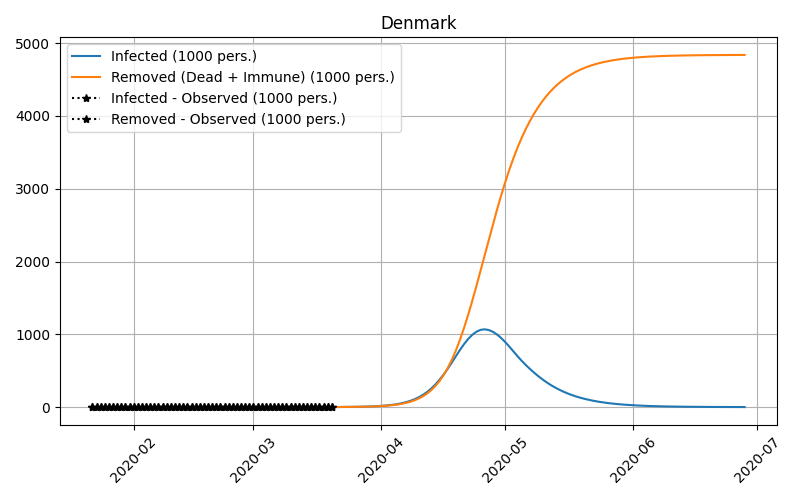

## Sunday 22/3 Update 2

Fitting the SIR model with unit population, setting N=1. This seems to make the estimation more numerical stable.
It make the beta and gamma estimates directly comparable across countries which makes it easier
to set sensible starting values. There is still a significant discrepancy in the plots between observed and 
predicted values, suggesting the model is somehow mis-specified or a pour fit to the problem. 

## Sunday 22/3

Fitting the SIR model on data from Denmark, Iran, Sweden, Italy, and Spain. With a fixed gamma value.
I have fixed the gamma value (1/infectious time) to 1/5, so assuming an infectious period of _five_ days. 
The strategy is to only estimate beta from data since the infectious period is given by nature and 
should be quite stable. The transmission rate on the  other hans changes with social behavior, quarantines 
and so forth. This makes the estimation much more stable. 

To get som additional degrees of freedom I also estimate I0 and R0, the number of infected and recovered at 
time _zero_. This is to get som flexibilty in fitting the data.

As seen below the result are somewhat meaningful, but som work still needs to be done. The next step is to look 
into SEIR model and hopefully the additional flexibility will yield more fitting predictions.  

The [Epidemic calculator](https://gabgoh.github.io/COVID/index.html) has a table of estimates of incubation periods 
and infectious periods, reproduced here:

| Article | Location | Reproduction Number | Incubation Period (in days) | Infectious Period (in days) |
|:-------:|:--------:|:-------------------:|:---------------------------:|:---------------------------:|
Kucharski et. al|Wuhan|3.0 (1.5 — 4.5)|5.2|2.9
Li, Leung and Leung|Wuhan|2.2 (1.4 — 3.9)|5.2 (4.1 — 7.0)|2.3 (0.0 — 14.9)
Wu et. al|Greater Wuhan|2.68 (2.47 — 2.86)|6.1|2.3
WHO Initial Estimate|Hubei|1.95 (1.4 — 2.5)||
WHO-China Joint Mission|Hubei|2.25 (2.0 — 2.5)|5.5 (5.0 - 6.0)|
Liu et. al|Guangdong|4.5 (4.4 — 4.6)|4.8 (2.2 — 7.4)|2.9 (0 — 5.9)
Rocklöv, Sjödin and Wilder-Smith|Princess Diamond|14.8|5.0|10.0
Backer, Klinkenberg, Wallinga|Wuhan||6.5 (5.6 — 7.9)|
Read et. al|Wuhan|3.11 (2.39 — 4.13)||
Bi et. al|Shenzhen||4.8 (4.2 — 5.4)|1.5 (0 — 3.4)|
Tang et. al|China|6.47 (5.71 — 7.23)||