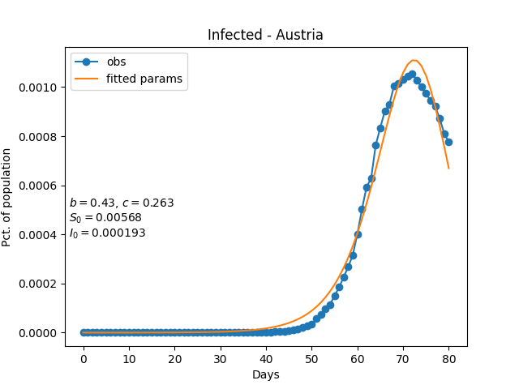
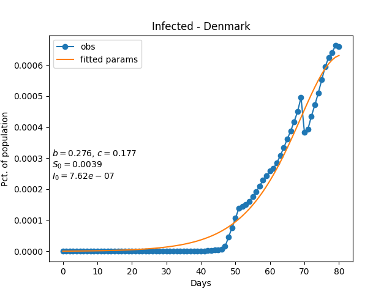
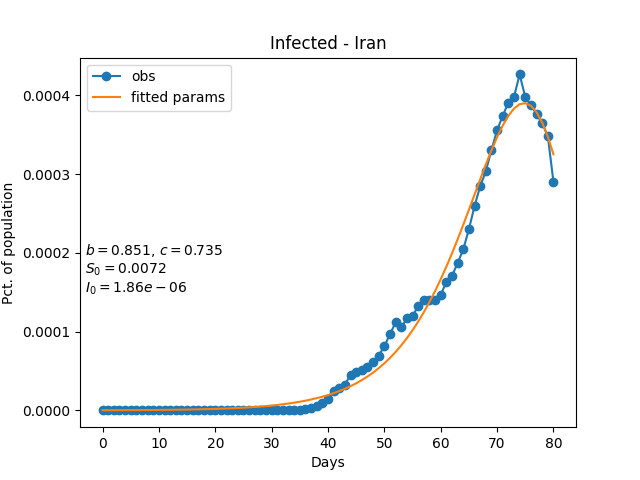
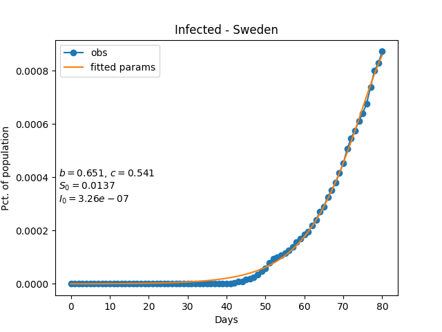
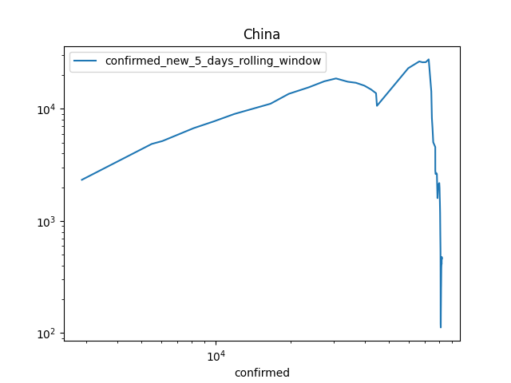
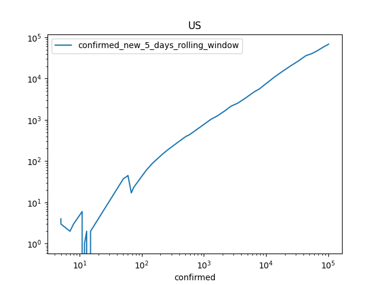
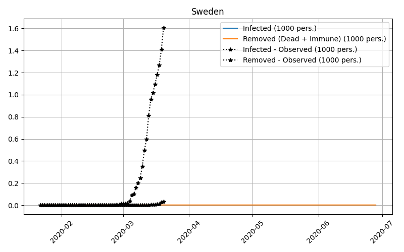

<script
  type="text/javascript"
  charset="utf-8"
  src="https://cdn.mathjax.org/mathjax/latest/MathJax.js?config=TeX-AMS-MML_HTMLorMML"
 >
</script>

## Wednesday 15/4

Implemented the closed form solution to the SIR model from [Bohner et al (2018)]. 
In the article they claim to find the solution to the classic SIR model of
[Bailey (1975)]. In equation (1) they define the model as,

$$
\frac{dS}{dt} = -b \frac{IS}{I + S} \\
\frac{dI}{dt} = b \frac{IS}{I + S} - cI \\
\frac{dR}{dt} = cI
$$

where I have translated their notation. They give the closed form solution to this system,
and the number of infected as a function of time is given by,
$$
I(t) = I_0 (1 + \kappa)^{b/(b-c)} \left(1 + \kappa e^{(b-c)(t-t_0)}\right)^{-b/(b-c)}e^{(b-c)(t-t_0)}
$$









[Bohner et al (2018)]: https://arxiv.org/abs/1812.09759
[Bailey (1975)]: https://www.amazon.com/Mathematical-Theory-Infectious-Diseases-2nd/dp/0852642318 
## Saturday 11/4

Instead of relying on approximation of the growth in new cases to be exponential,
maybe it's possible to simply back out a time varying beta using the
differential equation for `I_t` given a gamma is fixed.
```
dI_t/dt = beta * I_t * S_t - gamma*I_t       <=>
((dI_t/dt)/*I_t + gamma)/S_t = beta 
```
First I try it out on simulated data:


To operationalize this idea i estimate beta using a discrete approximation:

```python
df['beta_backed_out'] = (df['total_infected'].diff()/df['total_infected'].shift(-1) + GAMMA)/df['total_susceptible']
```


It's not entirely promising, nor a complete disaster. 

Trying it out on real data puts the nail in the coffin on that idea. Looking at the plot
first of all the beta estimates are very volatile, which might be fixed with some kind of smoother,
but the scale is completely off. Dividing by the number of susceptible which is on the order of
the total population of a country is too much. This might be a testimony to the true number of
susceptibles being much less than the total population,  especially in the eyes of a SIR-model. 


## Sunday 29/3

Implemented a linear regression estimating beta based on the approximation
```
I_t = I_0 * exp((R0 - 1) * gamma * t)
```
where `R0` is the basic reproduction rate. Taking logs:
```
log I_t = log I_0  + (R0 - 1) * gamma * t
```
So during the exponential phase, the slope parameter of a linear regression 
is an estimator for `(R0 - 1) * gamma`.  In SIR model the basic reproduction number 
`R0 = beta/gamma`, so a beta-estimator could be `beta = (slope/gamma + 1)*gamma`.


In the above plot we see the fitted regression line. Assuming a gamma of 0.345, which is equivalent 
with a average infectious period of 2.9 days, we can transform the slope to a beta estimate.

The above plot also indicates that the slope might be changing over time,
since new policy measures attempt to lower the transmission rate.  
To estimate a time varying slope an consequently transmission rate I have 
tried using a locally estimated scatterplot smoothing (LOESS). This is an easy to use
ad-hoc technique to estimate a varying slope.


Again a assuming a fixed recovery rate (gamma) of 0.345 infected per day, we get the following 
time varying estimates of the transmission rate.
 


The `beta_end_loess` curve represents the beta value at the last data point on the 
loess estimate. This value is a good candidate to use in forecasts.

## Saturday 28/3

Replicating the the plots presented in the minutephysics youtube video 
[How To Tell If We're Beating COVID-19](https://www.youtube.com/watch?v=54XLXg4fYsc) 
and the corresponding [interactive site](http://aatishb.com/covidtrends).





This got me thinking that I should try using a more robust estimation method
when fitting the the SIR model. Taking advantage of the (near) exponential growth
at the start of the pandemic and estimate the transmition rate (beta) with a linear
regression on log-transformed confirmed cases, varying across time. Even though minutephysics
said "never plot against time" :-) 

## Sunday 22/3 Update 2

Fitting the SIR model with unit population, setting N=1. This seems to make the estimation more numerical stable.
It make the beta and gamma estimates directly comparable across countries which makes it easier
to set sensible starting values. There is still a significant discrepancy in the plots between observed and 
predicted values, suggesting the model is somehow mis-specified or a pour fit to the problem. 


## Sunday 22/3

Fitting the SIR model on data from Denmark, Iran, Sweden, Italy, and Spain. With a fixed gamma value.
I have fixed the gamma value (1/infectious time) to 1/5, so assuming an infectious period of _five_ days. 
The strategy is to only estimate beta from data since the infectious period is given by nature and 
should be quite stable. The transmission rate on the  other hans changes with social behavior, quarantines 
and so forth. This makes the estimation much more stable. 

To get som additional degrees of freedom I also estimate I0 and R0, the number of infected and recovered at 
time _zero_. This is to get som flexibilty in fitting the data.

As seen below the result are somewhat meaningful, but som work still needs to be done. The next step is to look 
into SEIR model and hopefully the additional flexibility will yield more fitting predictions.  




The [Epidemic calculator](https://gabgoh.github.io/COVID/index.html) has a table of estimates of incubation periods 
and infectious periods, reproduced here:


| Article | Location | Reproduction Number | Incubation Period (in days) | Infectious Period (in days) |
|:-------:|:--------:|:-------------------:|:---------------------------:|:---------------------------:|
Kucharski et. al|Wuhan|3.0 (1.5 — 4.5)|5.2|2.9
Li, Leung and Leung|Wuhan|2.2 (1.4 — 3.9)|5.2 (4.1 — 7.0)|2.3 (0.0 — 14.9)
Wu et. al|Greater Wuhan|2.68 (2.47 — 2.86)|6.1|2.3
WHO Initial Estimate|Hubei|1.95 (1.4 — 2.5)||
WHO-China Joint Mission|Hubei|2.25 (2.0 — 2.5)|5.5 (5.0 - 6.0)|
Liu et. al|Guangdong|4.5 (4.4 — 4.6)|4.8 (2.2 — 7.4)|2.9 (0 — 5.9)
Rocklöv, Sjödin and Wilder-Smith|Princess Diamond|14.8|5.0|10.0
Backer, Klinkenberg, Wallinga|Wuhan||6.5 (5.6 — 7.9)|
Read et. al|Wuhan|3.11 (2.39 — 4.13)||
Bi et. al|Shenzhen||4.8 (4.2 — 5.4)|1.5 (0 — 3.4)|
Tang et. al|China|6.47 (5.71 — 7.23)||